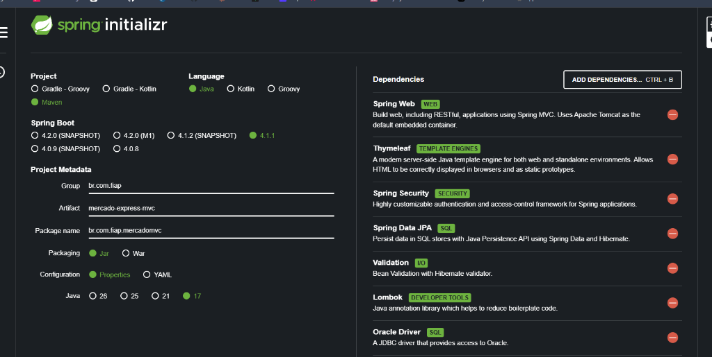

# Mercado Express MVC - Checkpoint 4 (Parte 2)

Aplicação Web desenvolvida em Java com Spring Boot MVC, Thymeleaf, Spring Security e Spring Data JPA para gerenciamento de estoque de produtos em um Mercado Express (produtos de limpeza, hortifruti, vestuário/meias, brinquedos e mercearia).

Projeto desenvolvido para o Checkpoint 4 (Parte 2) da disciplina de Desenvolvimento de Sistemas em Java do curso de Tecnologia em Análise e Desenvolvimento de Sistemas (TDS) - FIAP.

---

## Integrantes do Grupo

- Curso: Tecnologia em Análise e Desenvolvimento de Sistemas (TDS) - FIAP
- Turma: 2TDSPV
- Professor: Dr. Marcel Stefan Wagner
- IDE Utilizada: IntelliJ IDEA
- Integrantes:
  1. Leandro Guarido de Oliveira - RM: 561760
  2. Kaiky Costa - RM: 564578
  3. Gabriel Costa Solano - RM: 562325

---

## Links do Projeto

- Repositório GitHub (Parte 2): https://github.com/LeandroGuaridoOliveira/Java-gs4-pt2.git
- Repositório da Parte 1 (API REST + HATEOAS): https://github.com/LeandroGuaridoOliveira/Java-gs4.git
- Deploy em Produção: https://mercado-express-mvc-90ft.onrender.com
- Plataforma de Hospedagem: Render (Web Service baseado em container Docker)
- Vídeo de Apresentação: [Link do Vídeo no YouTube](COLOQUE_O_LINK_DO_VIDEO_AQUI)

---

## Tecnologias Utilizadas

- Linguagem: Java 17 LTS
- Framework: Spring Boot 3.3.2 (Maven)
- Spring MVC: Arquitetura Model-View-Controller com Thymeleaf
- Spring Security: Autenticação, autorização por perfis (ADMIN e USER) e proteção contra CSRF
- Spring Data JPA: Persistência relacional com Hibernate mapeando a tabela TDS_MVC_TB_MERCADO
- Validação de Dados: Jakarta Bean Validation (@NotBlank, @Positive, @Size)
- Lombok: Métodos de acesso e construtores
- Banco de Dados: H2 Database em memória (desenvolvimento e testes) e Oracle Database (produção FIAP)
- Front-end: Bootstrap 5.3, Bootstrap Icons e CSS customizado responsivo

---

## Segurança (Spring Security): Rotas Públicas e Privadas

A aplicação implementa controle de acesso granular distinguindo rotas públicas (acesso livre ao catálogo) e rotas privadas (operações de escrita):

| Tipo de Rota | Endpoint | Método | Permissão / Role | Descrição |
| :--- | :--- | :--- | :--- | :--- |
| Pública | `/` | GET | Livre (permitAll) | Página inicial com métricas gerais |
| Pública | `/produtos` | GET | Livre (permitAll) | Catálogo de produtos com filtro de busca |
| Pública | `/produtos/detalhes/{id}` | GET | Livre (permitAll) | Ficha técnica detalhada do produto |
| Pública | `/login` | GET | Livre (permitAll) | Tela de autenticação |
| Pública | `/css/**`, `/js/**` | GET | Livre (permitAll) | Recursos estáticos e folhas de estilo |
| Privada | `/produtos/novo` | GET | USER ou ADMIN | Formulário de cadastro de produto |
| Privada | `/produtos/salvar` | POST | USER ou ADMIN | Validação e persistência do produto |
| Privada | `/produtos/editar/{id}` | GET | USER ou ADMIN | Formulário de edição de produto |
| Privada | `/produtos/atualizar/{id}` | POST | USER ou ADMIN | Atualização do registro no banco |
| Privada | `/produtos/excluir/{id}` | GET | ADMIN | Exclusão do registro com modal de confirmação |

### Credenciais para Teste

| Usuário | Senha | Perfil (Role) | Nível de Acesso |
| :--- | :--- | :--- | :--- |
| `admin` | `admin123` | ADMIN, USER | Acesso Total: Visualizar, Cadastrar, Editar e Excluir produtos |
| `usuario` | `user123` | USER | Operador: Visualizar, Cadastrar e Editar produtos |

---

## Modelo de Dados (TDS_MVC_TB_MERCADO)

| Coluna | Tipo BD | Atributo Java | Restrições / Validações |
| :--- | :--- | :--- | :--- |
| ID | NUMBER(19) | Long id | Chave Primária (Sequence SQ_TDS_MVC_MERCADO) |
| NOME | VARCHAR2(100) | String nome | Obrigatório, min 2 e max 100 caracteres |
| TIPO | VARCHAR2(50) | String tipo | Obrigatório, max 50 caracteres (ex: Produto de Limpeza) |
| SETOR | VARCHAR2(50) | String setor | Obrigatório, max 50 caracteres (ex: Limpeza, Hortifruti) |
| TAMANHO | VARCHAR2(30) | String tamanho | Opcional, max 30 caracteres (ex: 1.6kg, 500ml, 39-43) |
| PRECO | NUMBER(10,2) | Double preco | Obrigatório, valor positivo |

---

## Funcionalidades do CRUD na Interface Web

As operações do CRUD foram implementadas através de links e botões na interface web:

1. **READ (Consulta / Listagem)**:
   - Catálogo geral em `/produtos` com tabela responsiva, badges estilizados por setor, formatação monetária (R$) e filtro de busca por nome.
   - Detalhes do produto em `/produtos/detalhes/{id}` exibindo a ficha completa do item.

2. **CREATE (Cadastro)**:
   - Formulário em `/produtos/novo` com validação de campos obrigatórios e exibição de alertas de sucesso/erro.

3. **UPDATE (Edição)**:
   - Formulário em `/produtos/editar/{id}` com pré-carregamento dos dados existentes.

4. **DELETE (Exclusão)**:
   - Ação em `/produtos/excluir/{id}` com modal de confirmação antes da remoção definitiva (restrita ao perfil ADMIN).

---

## Como Executar o Projeto Localmente

### Pré-requisitos
- JDK 17+ instalado
- Git

### 1. Clonar o Repositório
```bash
git clone https://github.com/LeandroGuaridoOliveira/Java-gs4-pt2.git
cd Java-gs4-pt2
```

### 2. Executar via Maven Wrapper
No Windows:
```cmd
mvnw.cmd spring-boot:run
```
No Linux / macOS:
```bash
./mvnw spring-boot:run
```

A aplicação iniciará na porta **8082**:
- Interface Principal: http://localhost:8082
- Catálogo de Produtos: http://localhost:8082/produtos
- Console H2: http://localhost:8082/h2-console (JDBC URL: `jdbc:h2:mem:mercadomvcdb`, Usuário: `sa`, Senha em branco)

### 3. Executar os Testes Automatizados
```bash
mvnw.cmd test
```

---

## Configuração do Spring Initializr

Dependências configuradas para a Parte 2:
- Spring Web (Spring MVC)
- Thymeleaf (Template Engine)
- Spring Security (Autenticação e Autorização)
- Spring Data JPA (Persistência relacional)
- Validation (Bean Validation)
- Lombok
- Oracle Driver
- H2 Database



---

## Estrutura de Arquivos da Entrega (.zip)

O arquivo `.zip` para envio no Teams do professor contém:
```
mercado-express-mvc.zip
├── integrantes.txt
├── spring_initializr.png
├── pom.xml
├── Dockerfile
├── README.md
└── src/
```